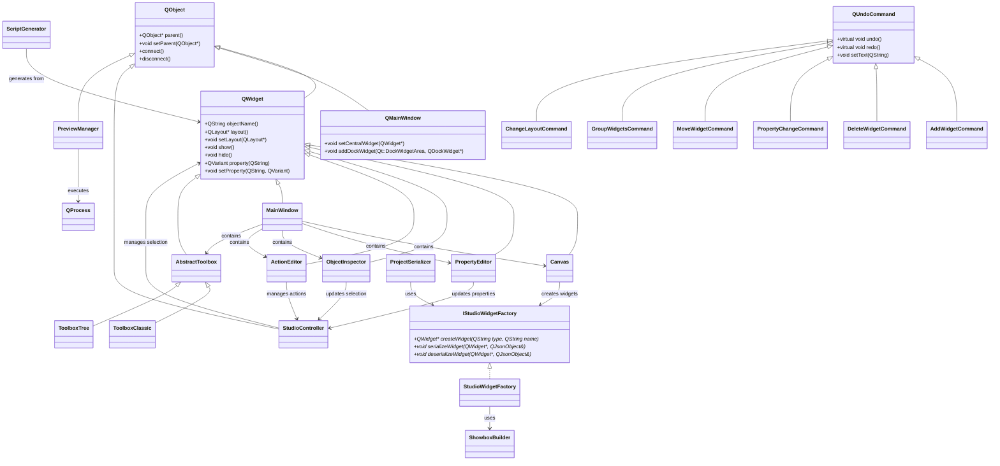

# Arquitetura do Showbox Studio

## Índice
1. [Visão Geral](#visão-geral)
2. [Diagrama de Classes](#diagrama-de-classes)
3. [Diagrama de Componentes](#diagrama-de-componentes)
4. [Fluxos de Dados](#fluxos-de-dados)
5. [Detalhamento de Classes](#detalhamento-de-classes)
6. [Padrões de Design](#padrões-de-design)

## Visão Geral

### Propósito do Projeto
O Showbox Studio é um ambiente de desenvolvimento integrado (IDE) visual para criação de interfaces utilizando o framework Showbox. O projeto permite a edição visual de interfaces através de arrastar-e-soltar, edição de propriedades e geração automática de scripts Showbox CLI.

### Tecnologias Utilizadas
- **C++17**: Linguagem principal
- **Qt6**: Framework GUI (Widgets, Charts, Svg)
- **CMake**: Sistema de build
- **Showbox Core**: Biblioteca de UI reutilizada
- **JSON**: Formato de serialização de projetos

### Estrutura de Diretórios
```
SHantilly-studio/
├── src/                    # Código fonte
│   ├── main.cpp           # Ponto de entrada
│   ├── core/              # Lógica de negócio
│   │   ├── StudioController.h/cpp    # Controle de seleção e eventos
│   │   ├── StudioWidgetFactory.h     # Factory de widgets
│   │   ├── ScriptGenerator.h/cpp     # Geração de scripts CLI
│   │   ├── ProjectSerializer.h/cpp   # Persistência JSON
│   │   ├── PreviewManager.h/cpp      # Execução de preview
│   │   └── StudioCommands.h          # Comandos Undo/Redo
│   └── gui/               # Interface gráfica
│       ├── MainWindow.h/cpp          # Janela principal
│       ├── Canvas.h/cpp              # Área de edição visual
│       ├── PropertyEditor.h/cpp      # Editor de propriedades
│       ├── ObjectInspector.h/cpp     # Hierarquia de objetos
│       ├── ActionEditor.h/cpp        # Editor de ações/callbacks
│       └── toolbox/                  # Paleta de widgets
├── docs/                # Documentação
├── packaging/           # Scripts de empacotamento
├── scripts/             # Utilitários
└── tests/               # Testes unitários
```

## Diagrama de Classes



## Diagrama de Componentes


## Fluxos de Dados

### Fluxo de Drag & Drop


### Fluxo de Seleção


### Fluxo de Undo/Redo


### Fluxo de Preview


### Fluxo de Save/Load


## Detalhamento de Classes

### StudioController
**Responsabilidade:** Gerencia a seleção de widgets e intercepta eventos através de eventFilter para controlar o comportamento no editor visual.

**Propriedades principais:**
- `m_selectedWidgets`: Lista de widgets selecionados
- `m_undoStack`: Pilha de comandos para undo/redo

**Métodos principais:**
- `manageWidget()`: Registra widget para controle
- `selectWidget()`: Define widget selecionado
- `undoStack()`: Retorna pilha de comandos

**Signals:**
- `widgetSelected(QWidget*)`: Emitido quando widget é selecionado
- `selectionChanged()`: Emitido quando seleção muda

**Slots:** Nenhum público

**Dependências:** QWidget, QUndoStack

### StudioWidgetFactory
**Responsabilidade:** Implementa a criação de widgets Showbox através do padrão Factory, utilizando ShowboxBuilder para garantir fidelidade visual.

**Propriedades principais:** Nenhuma (stateless)

**Métodos principais:**
- `createWidget()`: Cria widget baseado no tipo
- `serializeWidget()`: Serializa propriedades específicas
- `deserializeWidget()`: Desserializa propriedades

**Signals:** Nenhum

**Slots:** Nenhum

**Dependências:** ShowboxBuilder, WidgetConfigs

### ScriptGenerator
**Responsabilidade:** Converte a hierarquia de widgets em script Showbox CLI válido, incluindo comandos add/set e callbacks.

**Propriedades principais:**
- `m_callbacks`: Mapa de callbacks por widget/evento

**Métodos principais:**
- `generate()`: Gera script completo
- `processWidget()`: Processa widget recursivamente
- `getShowboxType()`: Mapeia tipos Qt para CLI
- `generateCallbacks()`: Cria funções callback

**Signals:** Nenhum

**Slots:** Nenhum

**Dependências:** QWidget, QString

### ProjectSerializer
**Responsabilidade:** Gerencia persistência de projetos em formato JSON, incluindo serialização/desserialização da hierarquia completa.

**Propriedades principais:** Nenhuma (stateless)

**Métodos principais:**
- `save()`: Salva projeto em arquivo
- `load()`: Carrega projeto de arquivo

**Signals:** Nenhum

**Slots:** Nenhum

**Dependências:** IStudioWidgetFactory, QJsonObject

### PreviewManager
**Responsabilidade:** Executa preview do script gerado através do Showbox CLI, capturando saída e erros.

**Propriedades principais:** Nenhuma

**Métodos principais:**
- `runPreview()`: Executa script via QProcess

**Signals:**
- `previewOutput(QString)`: Saída do processo
- `previewError(QString)`: Erros do processo
- `previewFinished(int)`: Código de saída

**Slots:** Nenhum

**Dependências:** QProcess

### Canvas
**Responsabilidade:** Área de edição visual que suporta drag & drop, seleção e manipulação direta de widgets.

**Propriedades principais:**
- `m_layout`: Layout principal
- `m_factory`: Factory para criar widgets
- `m_controller`: Controller para seleção
- `m_currentSelection`: Widget selecionado

**Métodos principais:**
- `addWidget()`: Adiciona widget ao canvas
- `removeWidget()`: Remove widget
- `setSelectedWidget()`: Define seleção

**Signals:**
- `widgetAdded(QWidget*)`: Novo widget adicionado
- `widgetSelected(QWidget*)`: Widget selecionado
- `requestGrouping(QString)`: Solicitação de agrupamento

**Slots:** Nenhum público

**Dependências:** IStudioWidgetFactory, StudioController

### PropertyEditor
**Responsabilidade:** Interface para edição visual das propriedades do widget selecionado.

**Propriedades principais:**
- `m_target`: Widget sendo editado
- `m_controller`: Controller para mudanças
- `m_isLoading`: Flag para evitar loops

**Métodos principais:**
- `setTargetWidget()`: Define widget alvo
- `addPropertyRow()`: Adiciona linha de propriedade

**Signals:** Nenhum

**Slots:**
- `onCellValueChanged()`: Valor alterado na tabela

**Dependências:** StudioController, QMetaProperty

### ObjectInspector
**Responsabilidade:** Exibe hierarquia de objetos/widgets em formato de árvore, permitindo navegação e seleção.

**Propriedades principais:**
- `m_widgetToItem`: Mapeamento widget->item da árvore
- `m_controller`: Controller para sincronização

**Métodos principais:**
- `updateHierarchy()`: Atualiza árvore completa
- `selectItemForWidget()`: Seleciona item correspondente

**Signals:**
- `itemSelected(QWidget*)`: Item selecionado na árvore
- `requestGrouping(QString)`: Solicitação de agrupamento

**Slots:**
- `onSelectionChanged()`: Seleção mudou na árvore

**Dependências:** StudioController

### ActionEditor
**Responsabilidade:** Permite configuração de ações/callbacks para eventos dos widgets (clicked, changed, etc.).

**Propriedades principais:**
- `m_target`: Widget sendo configurado
- `m_actionsData`: Dados JSON das ações

**Métodos principais:**
- `setTargetWidget()`: Define widget alvo
- `getActionsJson()`: Retorna configuração JSON

**Signals:**
- `actionsChanged()`: Ações modificadas

**Slots:**
- `onAddAction()`: Adicionar ação
- `onActionTypeChanged()`: Tipo alterado

**Dependências:** StudioController

### MainWindow
**Responsabilidade:** Janela principal que integra todos os componentes da IDE.

**Propriedades principais:**
- `m_canvas`: Área de edição
- `m_factory`: Factory de widgets
- `m_controller`: Controller principal
- `m_toolbox`: Paleta atual

**Métodos principais:**
- `setupUI()`: Configura interface
- `createSampleWidgets()`: Cria widgets de exemplo

**Signals:** Nenhum

**Slots:**
- `onRunClicked()`: Executar preview
- `onSaveClicked()`: Salvar projeto

**Dependências:** Todos os componentes principais

### AbstractToolbox
**Responsabilidade:** Interface abstrata para implementações de paleta de widgets.

**Propriedades principais:** Nenhuma

**Métodos principais:**
- `addCategory()`: Adiciona categoria com widgets

**Signals:**
- `widgetSelected(QString)`: Widget selecionado para drag

**Slots:** Nenhum

**Dependências:** QStringList

### ToolboxClassic
**Responsabilidade:** Implementação de toolbox usando QToolBox (estilo acordeão).

**Propriedades principais:**
- `m_toolBox`: Instância QToolBox

**Métodos principais:**
- `addCategory()`: Adiciona categoria como página

**Signals:** Herdados de AbstractToolbox

**Slots:** Nenhum

**Dependências:** QToolBox

### ToolboxTree
**Responsabilidade:** Implementação de toolbox usando QTreeWidget (árvore expansível).

**Propriedades principais:**
- `m_tree`: Instância QTreeWidget

**Métodos principais:**
- `addCategory()`: Adiciona categoria como nó pai
- `expandAll()`: Expande todas as categorias

**Signals:** Herdados de AbstractToolbox

**Slots:** Nenhum

**Dependências:** QTreeWidget

### Comandos (StudioCommands)
**Responsabilidade:** Implementam operações undo/redo seguindo QUndoCommand.

**Classes:**
- **AddWidgetCommand**: Adiciona widget ao canvas
- **DeleteWidgetCommand**: Remove widget
- **PropertyChangeCommand**: Altera propriedade
- **MoveWidgetCommand**: Move widget entre containers
- **GroupWidgetsCommand**: Agrupa widgets em container
- **ChangeLayoutCommand**: Altera layout de container

**Propriedades comuns:**
- Referências aos objetos afetados
- Valores antigos/novos para undo

**Métodos principais:**
- `undo()`: Reverte operação
- `redo()`: Executa operação

## Padrões de Design

### Command Pattern (StudioCommands)
Utilizado para implementar undo/redo. Cada operação é encapsulada em um comando que sabe como executar e reverter a ação. Permite pilha de comandos (QUndoStack) e operações compostas.

### Factory Pattern (StudioWidgetFactory)
Centraliza criação de widgets Showbox, isolando lógica de instanciação e garantindo configuração consistente através do ShowboxBuilder.

### Observer Pattern (Signals/Slots)
Qt Signals/Slots conectam componentes sem acoplamento forte:
- StudioController notifica mudanças de seleção
- Canvas emite eventos de drag/drop
- PreviewManager reporta progresso de execução

### Event Filter Pattern (StudioController)
QObject::eventFilter intercepta eventos antes que cheguem aos widgets, permitindo controle de comportamento (ex: impedir cliques reais em modo design).

### Builder Pattern (ShowboxBuilder)
Utilizado pelo Showbox core para construir widgets complexos passo-a-passo, separando criação da lógica de negócio.

### Abstract Factory (AbstractToolbox)
Permite diferentes implementações de toolbox (Classic, Tree) intercambiáveis através de interface comum.