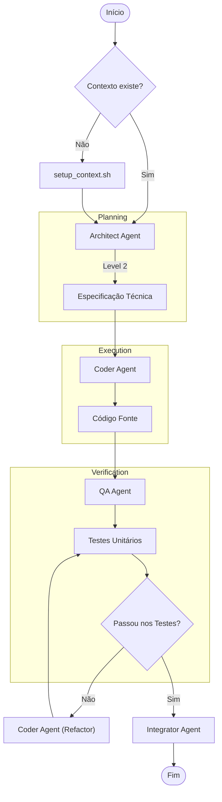
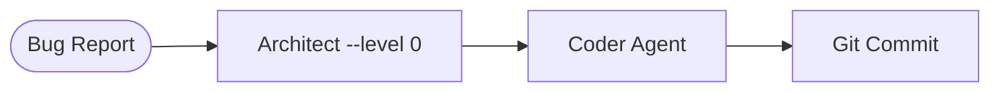
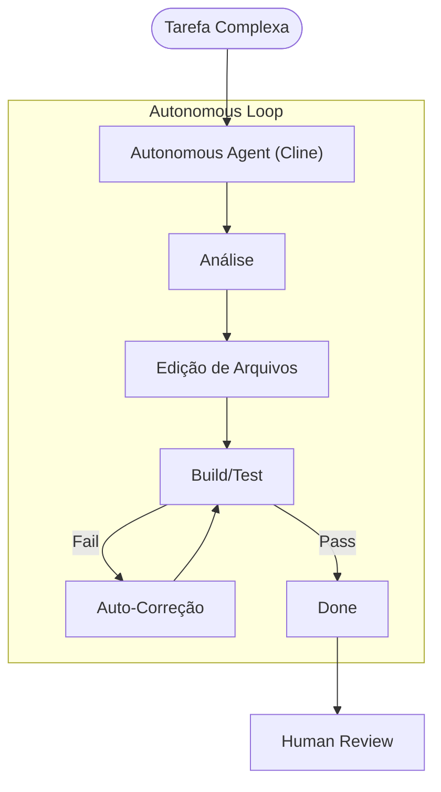
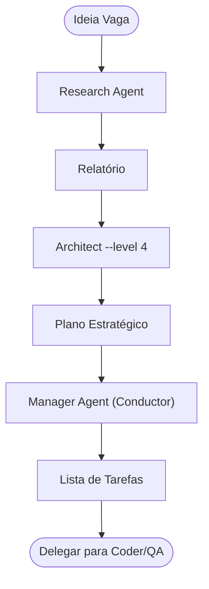

# Guia de Operação: Swarm Toolbelt

Este guia fornece a referência completa para a utilização dos agentes autônomos localizados em `scripts/swarm/`.

## 📋 Pré-requisitos

Antes de iniciar, garanta que o contexto do projeto está inicializado:

```bash
./scripts/setup_context.sh
```

## 🚀 Sequência Mínima (Happy Path)

Para desenvolver uma nova feature com segurança e qualidade:

1. **Planejar (Architect):**

   ```bash
   ./scripts/swarm/architect.sh "Implementar sistema de Login" --level 2
   ```

2. **Codificar (Coder):**

   ```bash
   ./scripts/swarm/coder.sh "Criar classe AuthManager seguindo o plano" src/auth/
   ```

3. **Testar (QA):**

   ```bash
   ./scripts/swarm/qa.sh "AuthManager"
   ```

---

## 🛠️ Referência de Comandos

| Agente         | Script          | Função                    | Parâmetros Chave               |
| :------------- | :-------------- | :------------------------ | :----------------------------- |
| **Architect**  | `architect.sh`  | Planejamento e Design     | `<descrição> [--level 0-4]`    |
| **Coder**      | `coder.sh`      | Implementação             | `<tarefa> [arquivos_contexto]` |
| **QA**         | `qa.sh`         | Testes Unitários          | `<nome_feature>`               |
| **Research**   | `research.sh`   | Pesquisa (Web/Docs)       | `<query>`                      |
| **Integrator** | `integrator.sh` | Git/GitHub/PRs            | `pr <N>` ou `review`           |
| **Autonomous** | `autonomous.sh` | Execução Longa (One-Shot) | `<tarefa_complexa>`            |
| **Manager**    | `manager.sh`    | Status do Projeto         | `<mensagem>`                   |

### Níveis do Architect (BMAD)

- **Level 0 (Atomic):** Correções rápidas, sem design.
- **Level 1 (Basic):** Features simples.
- **Level 2 (Standard):** Padrão (Arquitetura + Testes).
- **Level 3 (Detailed):** Design de sistemas complexos.
- **Level 4 (Strategic):** Decisões de alto nível e risco.

---

## 📊 Workflows (Mermaid)

### 1. Fluxo Padrão (Standard Development)

O ciclo mais seguro e recomendado para features novas.



### 2. Fluxo Rápido (Quick Fix / YOLO)

Para correções pequenas (typos, bugs óbvios).



### 3. Fluxo Autônomo (One-Shot)

Para tarefas complexas onde você confia na IA para resolver múltiplos passos sozinha (ex: Refatoração em massa).



### 4. Fluxo Estratégico (Strategic)

Para grandes mudanças arquiteturais que exigem pesquisa prévia.


